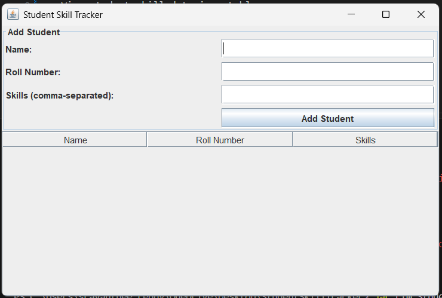

# 🎓 Student Skill Tracker

A simple Java GUI + CLI application to manage student names, roll numbers, and their skills. Designed for easy learning and project practice.

---

## 🚀 Features
- Add students with skills
- View student skill data in a table
- User-friendly GUI using `JFrame`
- CLI support for compilation and running

---

## 📸 Screenshot

Here’s how the Student Skill Tracker GUI looks:

## 📦 Project Structure

